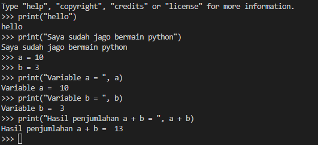

<h1>Lab2py</h1>

<h2>Latihan 1</h2>
<ul>
    <li>Menjalankan <b>Python Console</b></li>
    <ul>
        <li>Menampilkan tulisan "Hello" dilayar</li>
        <li>Menampilkan tulisan "Saya sudah jago bermain python" dilayar</li>
    </ul>
</ul>

<h2>Latihan 2</h2>
<ul>
    <li>Menjumlahkan dua buah bilangan menggunakan variabel a dan b.</li>
    <ul>
        <li>Mendefinisikan variable a dengan nilai 10</li>
        <li>Mendefinisikan variable b dengan nilai 3</li>
        <li>Mencetak nilai variable a dan b</li>
        <li>Mencetak hasil penjumlahan a + b</li>
    </ul>
</ul>

<h2>Latihan 3</h2>
<ul>
    <li>Menjalankan <b>IDLE</b></li>
    <ul>
        <li>Membuat file baru bernama <i>latihan3.py</i> didalam direktori <b>lab2py</b></li>
        <li>Menggunakan fungsi <b>input</b> untuk mengambil nilai variable dari keyboard</li>
    </ul>
</ul>

<h2>Bermain dengan Pycharm</h2>
<ol>
    <li>Membuat virtual environment</li>
     
    
    <li>Membuat file baru</li>
     
    
    <li>Menjalankan program</li>
     
    
</ol>